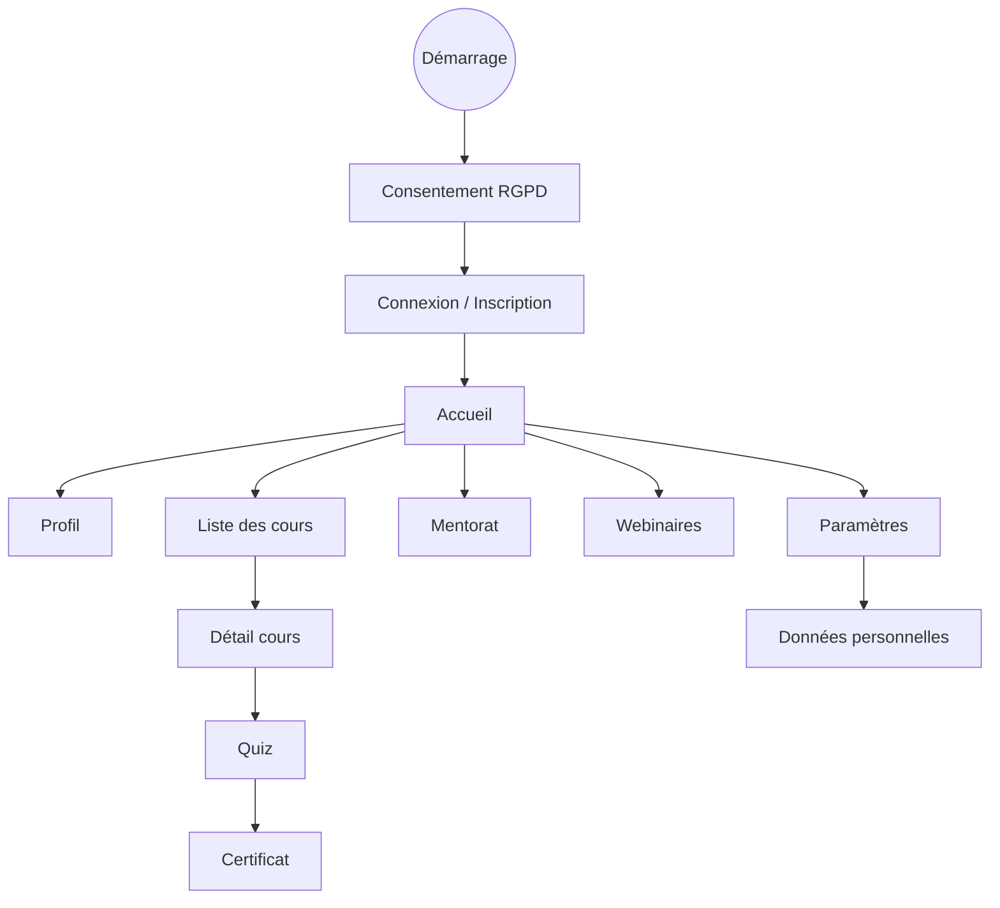
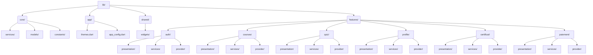
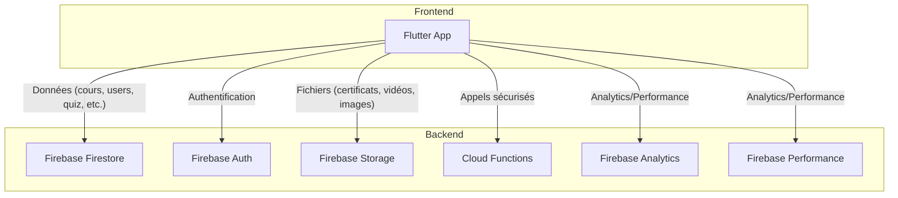

[](https://github.com/USERNAME/REPO/actions)
[](https://codecov.io/gh/USERNAME/REPO)

# UniMentorAI

**UniMentorAI** est une plateforme éducative globale, inclusive et sécurisée, développée avec Flutter, Firebase et Provider.

## 🚀 Fonctionnalités principales
- Authentification sécurisée (Firebase, Google, Apple)
- Gestion de cours, progression, quiz, certificats
- Paiement intégré (Stripe, PayPal, Kkiapay)
- Notifications, chat, mentoring, webinars
- Internationalisation (plus de 30 langues)
- Accessibilité et conformité RGPD

## 🏗️ Architecture
- **Flutter** (mobile, web, desktop)
- **Provider / Riverpod** pour la gestion d’état
- **Firebase** (auth, firestore, storage, messaging, analytics)
- **Services** centralisés dans `lib/shared/services/`
- **Widgets réutilisables** dans `lib/shared/widgets/`
- **Tests** dans `test/` et `integration_test/`

## 🔒 Sécurité
- Stockage sécurisé avec `flutter_secure_storage`
- Permissions strictes et audit Firestore
- Secrets/API via stockage sécurisé (flutter_secure_storage, jamais dans les assets)

## 🛡️ RGPD & Données personnelles
- Consentement utilisateur explicite (bannière/écran)
- Suppression automatique ou sur demande des données
- Section “Données personnelles” dans les paramètres
- Hébergement Firebase (hors UE) documenté dans les mentions légales

## ♿ Accessibilité (détail)
- Tous les boutons et champs importants utilisent des widgets `Semantics` pour les lecteurs d’écran.
- Contrastes vérifiés via la palette de couleurs (`app/colors/`).
- Support du `textScaleFactor` pour l’agrandissement des textes.
- Navigation clavier (tabulation, focus) sur tous les écrans principaux.
- Bannière de consentement RGPD accessible (clavier, lecteur d’écran).
- Dark mode automatique et toggle accessible.
- Messages d’erreur clairs et accessibles.
- Tests d’accessibilité automatisés via `flutter_test`.

## 📄 Mentions légales
- [Mentions légales et RGPD](docs/MENTIONS_LEGALES.md)

## 🤝 Contribution
- Voir [CONTRIBUTING.md](CONTRIBUTING.md) pour les bonnes pratiques et le guide de contribution.
- Code de conduite : [CODE_OF_CONDUCT.md](CODE_OF_CONDUCT.md)
- Politique de sécurité : [SECURITY.md](SECURITY.md)
- Exemple de Pull Request :
  - Décrire la fonctionnalité/correction
  - Ajouter des captures d’écran si besoin
  - Lister les tests ajoutés
  - Lien vers l’issue associée

## 🏷️ Badges
- Build:  <!-- TODO: Remplacer par l’URL réelle -->
- Coverage:  <!-- TODO: Remplacer par l’URL réelle -->

## Import/Export Firestore (CSV)

### Exporter les cours en CSV
- Utiliser la console Firestore ou un script Node.js pour exporter la collection `courses` en CSV.
- Exemple de script Node.js pour export CSV :
```js
const admin = require('firebase-admin');
const serviceAccount = require('./serviceAccountKey.json');
const fs = require('fs');
admin.initializeApp({ credential: admin.credential.cert(serviceAccount) });
const db = admin.firestore();
async function exportCoursesToCSV() {
  const snapshot = await db.collection('courses').get();
  const rows = ['id,title,description'];
  snapshot.forEach(doc => {
    const d = doc.data();
    rows.push(`${doc.id},"${d.title}","${d.description}"`);
  });
  fs.writeFileSync('courses_export.csv', rows.join('\n'));
  console.log('Export CSV terminé !');
}
exportCoursesToCSV();
```

## FAQ
- **Comment réinitialiser mon mot de passe ?**
  - Depuis l’écran de connexion, cliquer sur “Mot de passe oublié” et suivre les instructions.
- **Comment supprimer mon compte ?**
  - Depuis le profil, cliquer sur “Supprimer mon compte” (action irréversible).
- **Comment changer la langue de l’application ?**
  - Depuis les paramètres ou l’icône de langue sur l’écran d’accueil.
- **Comment contacter le support ?**
  - Via le formulaire de contact ou par email à contact@unimentorai.com.
- **Comment activer/désactiver les notifications ?**
  - Depuis les paramètres de l’application.

## Dépannage (Troubleshooting)
- **Erreur de connexion Firebase**
  - Vérifier la connexion internet, les permissions, et les clés dans `.env`.
- **Problème de paiement**
  - Vérifier la validité de la carte, le solde, ou contacter le support.
- **L’application ne démarre pas**
  - Lancer `flutter pub get`, puis `flutter clean` et `flutter run`.
- **Traductions manquantes**
  - Vérifier les fichiers ARB dans `lib/l10n/`.
- **Erreur de compilation**
  - Vérifier les imports, relancer `flutter pub get`.

## Schéma UX (parcours utilisateur)


## Structure du projet (post-refonte)

```
lib/
│
├── app/                       # Thèmes, couleurs, config env
│   ├── colors/                # Palette de couleurs
│   └── env/                   # Gestion multi-environnement (dotenv)
│
├── core/                      # Services et modèles globaux
│   ├── services/              # Ex : auth_service.dart
│   └── models/                # Ex : user_model.dart
│
├── features/                  # Organisation par domaine fonctionnel
│   ├── auth/                  # Authentification (login, signup, etc.)
│   ├── courses/               # Gestion des cours
│   ├── quiz/                  # Quiz et évaluations
│   ├── paiement/              # Paiement et transactions
│   ├── certificat/            # Gestion des certificats
│   ├── mentoring/             # Mentorat
│   ├── profile/               # Profil utilisateur
│   ├── settings/              # Paramètres
│   ├── webinar/               # Webinaires
│   ├── localization/          # Localisation et providers de langue
│   └── app/                   # Accueil/dashboard
│
├── widgets/                   # Composants réutilisables (boutons, etc.)
├── l10n/                      # Fichiers de traduction
├── main.dart                  # Point d’entrée de l’application
```

### Schéma d'architecture (Mermaid)


Chaque feature contient :
- `presentation/` : écrans et UI
- `services/` : services spécifiques
- `provider/` : providers Riverpod

> Voir la documentation pour plus de détails sur chaque dossier.

---
© UniMentorAI – Tous droits réservés.

## Import/Export de cours Firestore

### Importer un fichier JSON (ex : `courses_seed.json`)

**Via la console Firebase** :
1. Ouvre la [console Firestore](https://console.firebase.google.com/)
2. Va dans la collection `courses`
3. Clique sur “Ajouter un document” et copie-colle le contenu du JSON

**Via un script Node.js** :
```js
// Exemple d’import de cours en Node.js
const admin = require('firebase-admin');
const serviceAccount = require('./serviceAccountKey.json');
const courses = require('./courses_seed.json');

admin.initializeApp({ credential: admin.credential.cert(serviceAccount) });
const db = admin.firestore();

async function importCourses() {
  for (const course of courses) {
    await db.collection('courses').add(course);
  }
  console.log('Import terminé !');
}
importCourses();
```

### Exporter les cours
- Utilise la console Firestore (sélectionne les documents, clique sur “Exporter”)
- Ou utilise un script Node.js pour lire la collection et écrire dans un fichier JSON/CSV

> Voir `courses_seed.json` pour un exemple de structure de cours multilingue.

## Diagramme d’architecture (exemple)



## ⚡ Optimisation des assets

Pour garantir la performance et la rapidité de l’application, toutes les images (PNG/JPG) et vidéos (MP4) doivent être compressées automatiquement avant d’être ajoutées au dépôt.

- Utiliser le script PowerShell suivant :

```powershell
# Optimise les images et vidéos du dossier assets/
pwsh tools/optimize_assets.ps1
```

- Prérequis : installer [cwebp](https://developers.google.com/speed/webp/download) et [ffmpeg](https://ffmpeg.org/download.html) et les ajouter au PATH.
- Le script convertit toutes les images en WebP (qualité 80) et compresse les vidéos en H.265.
- À lancer après chaque ajout d’asset ou en CI/CD.

## ⚙️ Audit Qualité Automatisé

UniMentorAI dispose d'un système d'audit automatisé complet pour garantir la qualité, la conformité et la scalabilité.

### Commandes Rapides

```bash
# Audit global complet
make quality-check

# Audit spécifique
make audit-arch      # Architecture
make audit-security  # Sécurité
make audit-access    # Accessibilité
make audit-rgpd      # RGPD

# Tests et build
make test-all        # Tests complets
make test-coverage   # Tests avec couverture
make build-all       # Build toutes plateformes

# Optimisation
make optimize-assets # Optimise images/vidéos
make clean-all       # Nettoyage complet
```

### Scripts d'Audit Disponibles

- `tools/audit_all.js` - Audit global automatisé
- `tools/audit_architecture.js` - Architecture Clean Architecture
- `tools/audit_form_validators.js` - Validateurs de formulaires
- `tools/audit_api_keys.js` - Détection de clés API
- `tools/audit_accessibility.js` - Accessibilité WCAG 2.1
- `tools/audit_rgpd_links.js` - Conformité RGPD
- `tools/audit_test_coverage.js` - Couverture de tests
- `tools/audit_ui_theme.js` - Uniformité UX/UI
- `tools/audit_l10n_arb.js` - Internationalisation
- `tools/audit_pedagogie_gamification.js` - Pédagogie & Gamification
- `tools/audit_gouvernance_admin.js` - Gouvernance & Admin
- `tools/audit_appstore_assets.js` - Assets App Stores
- `tools/audit_contributors_admin.js` - Contributions externes

### CI/CD Automatisé

Le workflow GitHub Actions exécute automatiquement :
- Audit global de qualité
- Tests unitaires, widgets et intégration
- Analyse statique (`flutter analyze`)
- Couverture de code (>80%)
- Build pour Android et Web
- Tests de performance

### Rapports Automatiques

- `audit_report.md` - Rapport détaillé d'audit
- Couverture de code sur Codecov
- Badges de qualité dans le README
## Certificats numériques

UniMentorAI délivre des certificats numériques sécurisés, vérifiables et conformes aux standards internationaux.

- **QR code unique** sur chaque certificat (PDF et web)
- **Vérification en ligne** instantanée (scan ou URL)
- **Export CSV** pour les administrateurs
- **Accessibilité** (PDF, web, mobile, ARIA, contraste)
- **Automatisation CI/CD** (tests, export, traçabilité)

👉 [Guide complet d’administration des certificats](docs/certificats_admin_guide.md)

### Flux utilisateur
1. L’utilisateur termine un cours et clique sur « Générer mon certificat »
2. Le certificat est créé dans Firestore, un QR code est généré
3. L’utilisateur peut afficher, télécharger ou imprimer son certificat (PDF)
4. Toute personne peut vérifier l’authenticité via le QR code ou l’URL
5. Les admins peuvent exporter la liste des certificats délivrés (CSV)

## Digital Certificates

UniMentorAI issues secure, verifiable digital certificates, compliant with international standards.

- **Unique QR code** on every certificate (PDF and web)
- **Instant online verification** (scan or URL)
- **CSV export** for administrators
- **Accessibility** (PDF, web, mobile, ARIA, contrast)
- **CI/CD automation** (tests, export, traceability)

👉 [Full certificate administration guide (FR)](docs/certificats_admin_guide.md)
👉 [Full certificate administration guide (EN)](docs/certificats_admin_guide_en.md)

### User flow
1. The user completes a course and clicks “Generate my certificate”
2. The certificate is created in Firestore, a QR code is generated
3. The user can view, download, or print their certificate (PDF)
4. Anyone can verify authenticity via QR code or URL
5. Admins can export the list of issued certificates (CSV)

## Configuration obligatoire pour contributeurs

Avant toute contribution, chaque développeur doit exécuter les commandes suivantes :

```sh
flutter doctor
flutter analyze
dart test
dart run tools/audit_all.dart
```

Assurez-vous que `flutter doctor` ne retourne aucune erreur avant de soumettre une PR.

